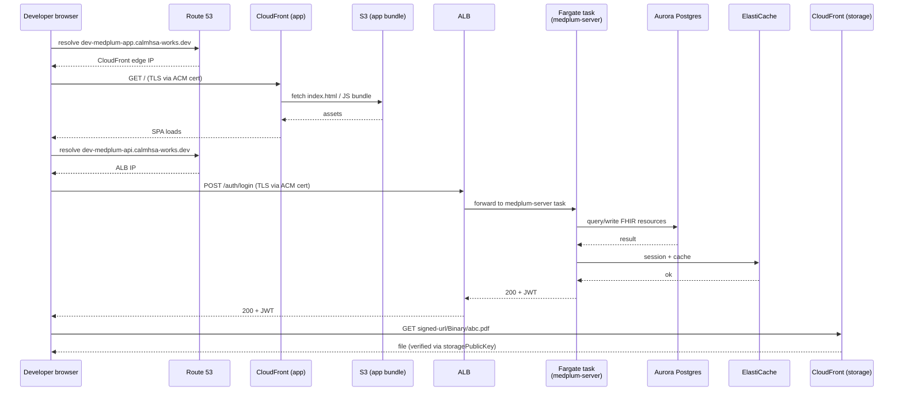

# Medplum AWS Dev Deployment — Architecture Diagram

**Environment:** dev
**Region:** us-east-1 (N. Virginia)
**AWS Account:** Development (039612846297)
**Route 53 zone:** calmhsa-works.dev
**Deployment method:** Official Medplum CDK (`@medplum/cdk`)
**Date:** 2026-05-22

---

## High-Level Architecture

```mermaid
flowchart TB
    subgraph Internet["🌐 Internet"]
        Devs["3 Developers<br/>(browser + Postman)"]
    end

    subgraph R53["Route 53 — calmhsa-works.dev (global)"]
        DNS1["dev-medplum-app.calmhsa-works.dev"]
        DNS2["dev-medplum-api.calmhsa-works.dev"]
        DNS3["dev-medplum-storage.calmhsa-works.dev"]
    end

    subgraph ACM["ACM Certs (us-east-1)"]
        Cert1["app cert"]
        Cert2["api cert"]
        Cert3["storage cert"]
    end

    subgraph AWS["AWS us-east-1 — Account 039612846297"]
        direction TB

        subgraph Edge["Edge / CDN"]
            CF_App["CloudFront<br/>(app distribution)"]
            CF_Stor["CloudFront<br/>(storage distribution<br/>+ signed URLs)"]
            WAF["AWS WAF"]
        end

        subgraph S3["S3"]
            S3_App["S3: medplum-app-bundle<br/>(static React build)"]
            S3_Stor["S3: medplum-storage<br/>(FHIR Binary attachments)"]
        end

        subgraph VPC["VPC (10.0.0.0/16, 2 AZs)"]
            direction TB

            subgraph Public["Public Subnets (2 AZs)"]
                ALB["Application Load Balancer<br/>HTTPS:443"]
                NAT["NAT Gateway"]
            end

            subgraph Private["Private Subnets (2 AZs)"]
                subgraph ECS["ECS Fargate Cluster"]
                    Task1["medplum-server task 1<br/>1 vCPU / 2 GB"]
                    Task2["medplum-server task 2<br/>1 vCPU / 2 GB"]
                end

                RDS[("RDS Aurora PostgreSQL<br/>db.t3.medium<br/>1 instance")]
                Redis[("ElastiCache Redis<br/>cache.t3.micro<br/>1 node")]
            end
        end

        subgraph Ops["Observability & Secrets"]
            CW["CloudWatch Logs"]
            SM["Secrets Manager<br/>(DB creds)"]
            SSM["SSM Parameter Store<br/>(~13 params)"]
        end
    end

    Devs --> DNS1
    Devs --> DNS2
    Devs --> DNS3

    DNS1 --> CF_App
    DNS2 --> ALB
    DNS3 --> CF_Stor

    Cert1 -.attached.-> CF_App
    Cert2 -.attached.-> ALB
    Cert3 -.attached.-> CF_Stor

    WAF -.protects.-> CF_App
    WAF -.protects.-> ALB

    CF_App --> S3_App
    CF_Stor --> S3_Stor

    ALB --> Task1
    ALB --> Task2

    Task1 --> RDS
    Task2 --> RDS
    Task1 --> Redis
    Task2 --> Redis
    Task1 --> S3_Stor
    Task2 --> S3_Stor

    Task1 -.logs.-> CW
    Task2 -.logs.-> CW
    Task1 -.reads.-> SM
    Task2 -.reads.-> SM
    Task1 -.reads.-> SSM
    Task2 -.reads.-> SSM

    Task1 -.egress.-> NAT
    Task2 -.egress.-> NAT
```

---

## Request flow (golden path)

---

## What's deployed by `npx cdk deploy`

| Layer            | Resource                            | Sizing (dev)                  |
|------------------|-------------------------------------|-------------------------------|
| Network          | VPC, 2 public + 2 private subnets   | 10.0.0.0/16, 2 AZs            |
| Network          | NAT Gateway                         | 1× (single AZ, dev cost-save) |
| Compute          | ECS Fargate cluster + service       | 2 tasks × 1 vCPU / 2 GB       |
| Compute          | Application Load Balancer           | 1× internet-facing            |
| Data             | RDS Aurora PostgreSQL               | 1× db.t3.medium               |
| Cache            | ElastiCache Redis                   | 1× cache.t3.micro             |
| Static hosting   | S3 + CloudFront (app)               | bundle bucket + CDN           |
| Binary storage   | S3 + CloudFront (storage, signed)   | attachments bucket + CDN      |
| DNS              | Route 53 records (existing zone)    | 3× A/Alias                    |
| TLS              | ACM certs                           | 3× (all us-east-1)            |
| Security         | WAF (default rules)                 | attached to ALB + CF          |
| Secrets          | Secrets Manager + SSM Param Store   | ~13 params                    |
| Logs             | CloudWatch Log Groups               | server + ALB                  |

**Out of scope (explicitly):** SES, Bot Lambda Layer, ClamAV antivirus, RDS Proxy, RDS reader, Fargate autoscaling, multi-AZ failover.

---

## Cost — 3 developers, dev environment, us-east-1

**Important:** cost is **almost entirely driven by *uptime*, not user count.** 3 developers vs 30 makes negligible difference at dev scale — the EC2/RDS/ECS instances run 24×7 regardless. The only user-driven costs are CloudFront egress and S3 storage, both trivial at 3 users.

### If the stack runs 24×7 (always-on)

| Service                            | Sizing                              | Monthly (USD) |
|-----------------------------------|-------------------------------------|---------------|
| RDS Aurora PostgreSQL              | 1× db.t3.medium (~$0.082/hr)        | ~$60          |
| Aurora storage + I/O               | ~20 GB + low IOPS                   | ~$5           |
| ECS Fargate                        | 2 tasks × (1 vCPU + 2 GB) × 24×7    | ~$50          |
| Application Load Balancer          | 1× ALB + LCU                        | ~$18          |
| NAT Gateway                        | 1× + ~10 GB egress                  | ~$35          |
| ElastiCache Redis                  | 1× cache.t3.micro                   | ~$12          |
| S3 (app bundle + storage)          | ~5 GB total                         | ~$1           |
| CloudFront (app + storage)         | ~10 GB egress for 3 devs            | ~$2           |
| Route 53                           | hosted zone (already exists)        | $0 (existing) |
| ACM certs                          | public certs                        | $0            |
| CloudWatch Logs                    | ~5 GB ingest + retention            | ~$5           |
| Secrets Manager + SSM              | ~5 secrets + 13 params              | ~$3           |
| WAF                                | 1 WebACL + few rules                | ~$8           |
| Data transfer (misc)               | inter-AZ + egress                   | ~$5           |
| **Total (24×7)**                   |                                     | **≈ $200–$230/mo** |

### If you stop the stack overnight + weekends (cost-saver mode)

Roughly **12 hrs/day × 5 days = 25% uptime → ~$70–$90/mo**, but only the *compute* portions scale down (Fargate, RDS, ElastiCache). NAT, ALB, S3, CloudFront still bill 24×7. Realistic savings are ~40%, landing at **~$120–$140/mo**.

This is doable with a scheduled Lambda or just `aws ecs update-service --desired-count 0` + `aws rds stop-db-cluster` each evening. I can add this as a Section-3 add-on if you want.

### Per-developer breakdown (24×7)

≈ **$200 / 3 = ~$67 per developer per month.** This is essentially a flat cost — adding a 4th, 5th, 10th developer would barely move the number (maybe +$2/mo for CloudFront egress and CloudWatch).

### Cost levers you can pull later

| Lever                                       | Saves    | Trade-off                              |
|---------------------------------------------|----------|----------------------------------------|
| Drop Fargate to 1 task                      | ~$25/mo  | Single point of failure (fine for dev) |
| Use VPC endpoints instead of NAT for S3/SSM | ~$30/mo  | More CDK config, no real downside      |
| Stop RDS/Fargate nights+weekends            | ~$60/mo  | First request of the day takes 2-3 min |
| Use db.t4g.medium (Graviton) instead of t3  | ~$8/mo   | Free win, just newer instance family   |
| Skip WAF for dev                            | ~$8/mo   | Lower security posture                 |

Realistic optimized dev cost: **~$140–$160/mo** with all above applied.

---

## Open questions before we proceed

1. Confirm you have **AdministratorAccess** (or equivalent) in account `039612846297` for the IAM user running `cdk deploy`.
2. Confirm the existing `calmhsa-works.dev` Route 53 zone is in the same AWS account (`039612846297`). If it's in a different account, we need either cross-account delegation or to add the dev-medplum-* records manually after deploy.
3. Confirm `dev-medplum-*` subdomain naming is fine (we already agreed earlier; flagging here so it's visible in the diagram).
